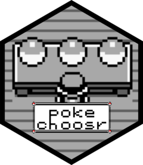

<!-- README.md is generated from README.Rmd. Please edit that file -->

```{r, include = FALSE}
knitr::opts_chunk$set(
  collapse = TRUE,
  comment = "#>",
  fig.path = "man/figures/README-",
  out.width = "100%"
)
```

# pokechoosr

<!-- badges: start -->

<!-- badges: end -->

The goal of pokechoosr is to provide a fun and (almost) statistical way to choose your teams in the mainline Pokemon games based on each pokemon's stats. A detailed description of how this is done can be seen in the package's vignettes. This package does not support decision based on trainers/gym leaders present in each game (yet)!


## Installation

You can install the development version of pokechoosr from [GitHub](github.com) with:

``` r
# install.packages("devtools")
devtools::install_github("victordogo/pokechoosr")
```

## Example

